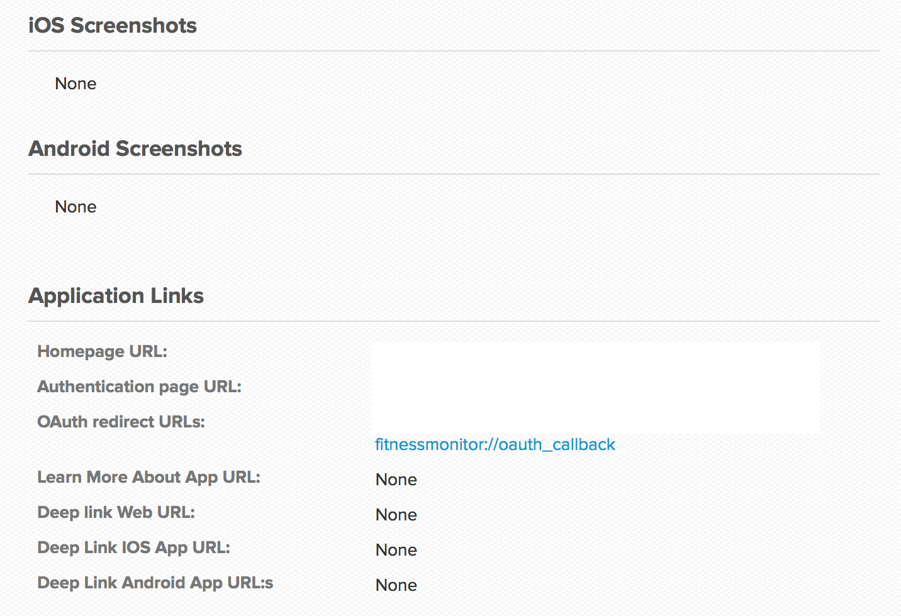
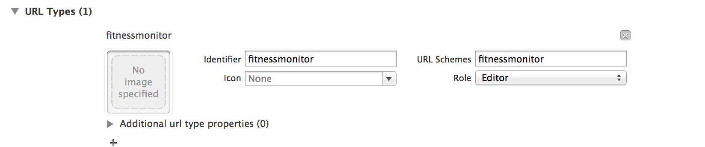

Jawbone Cordova oAuth
=====================

This is a Jawbone up tutorial for authenticate with oAuth and get first data


## Requirements
- Cordova
- Plugin: org.apache.cordova.inappbrowser


## 1. Create Cordova App with the inappbrowserplugin
## 2. Register an Application at Jawbone Developer API

After Registration you must register a Redirect URL on Jawbone, like fitnessmonitor://oauth_callback.

Then you get a Client_id and a Client_secret.



Copy them to the Javascript Variables "client_id" and "client_secret".
```js

var client_id = ''; // Your Client id here
var client_secret = ''; // Your Secret here

```

## 3. Register URL Type in xCode info.plist


## The Code

### oAuth Authentication
This show an inappbrowser with the oAuth URL of Jawbone. Also set in scope, what data you will read or write from Jawbone

```js
var browser;

...

function login() {
    //see for this 3. Register URL Type in xCode info.plist
    var redirect_uri = 'fitnessmonitor://oauth_callback';
    //Authentication to read or write Data, see jawbone API
    var scope = 'extended_read+basic_read+move_read+sleep_read';
    //Generate URL
    var url = 'https://jawbone.com/auth/oauth2/auth?response_type=code&client_id=' + client_id +
        '&redirect_uri=' + redirect_uri +
        '&scope=' + scope;
    browser = window.open(url, '_blank', 'location=yes');
}

...

```

### oAuth Callback

After the Authentication was successful the Browser redirect to "redirect_uri", this is handled in handleOpenURL Method.
Here the Code for this:

```js

function handleOpenURL(url) {
    setTimeout(function() {
        url = url.split('?')[1];
        url = url.replace('code=', '');
        // now in url is the code. 
        login_Redirect(url);
        
        browser.close();

    }, 100);
}

```

### oAuth get Access Token

The Code has a life Time of 10 Minutes. So you must request now the access Token for the user, by doing this:

```js

function login_Redirect(code) {
    var url = 'https://jawbone.com/auth/oauth2/token';
    
    var xhr = new XMLHttpRequest();
    xhr.open('POST', url);
    xhr.setRequestHeader('Content-type', 'application/x-www-form-urlencoded');
    
    //This will return an error or the token
    xhr.onload = function() {
        if(this.status === 200) {
            var data = JSON.parse(this.response);
            //write expire time in Datetime
            data.expires_in = new Date(new Date().getTime() + data.expires_in*1000);
            //save Token in localStorage
            localStorage.oAuth2 = JSON.stringify(data);
        } else {
            alert('ERROR ON RESPONSE');
            // TODO: Handle Error
        }
    }
    
    //Send client_id, client_secret and code for authentication
    xhr.send('client_id=' + client_id + '&' +
        'client_secret=' + client_secret + '&' +
        'grant_type=authorization_code' + '&' +
        'code=' + code);
}

```

Now you can see in the Data the access_token and the update_token. The access_token has a life Time of one Year. This is also in attribute expires_in (in seconds).
